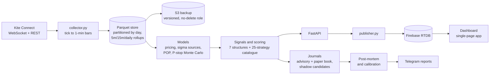
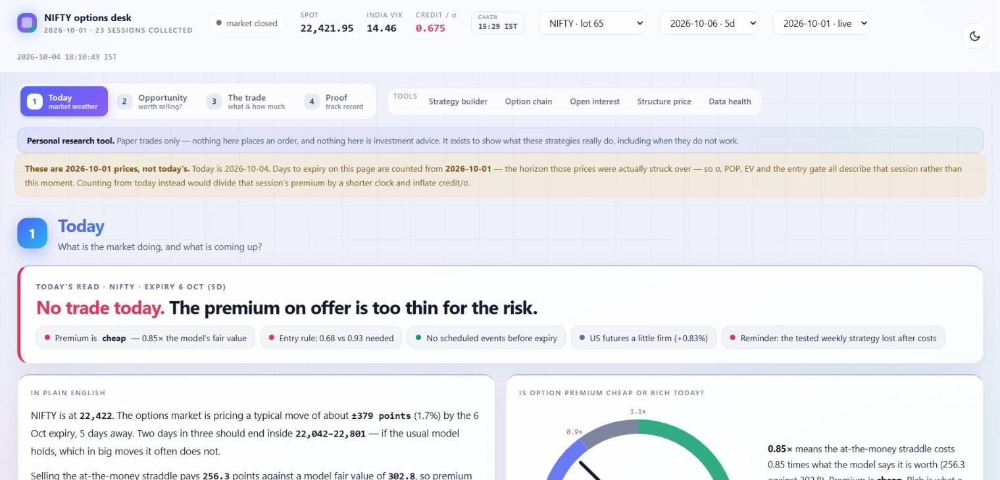
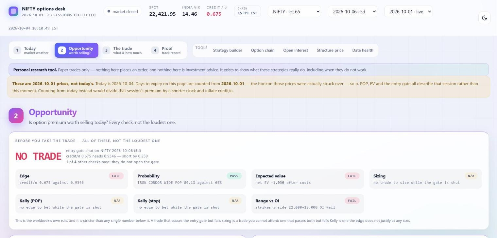
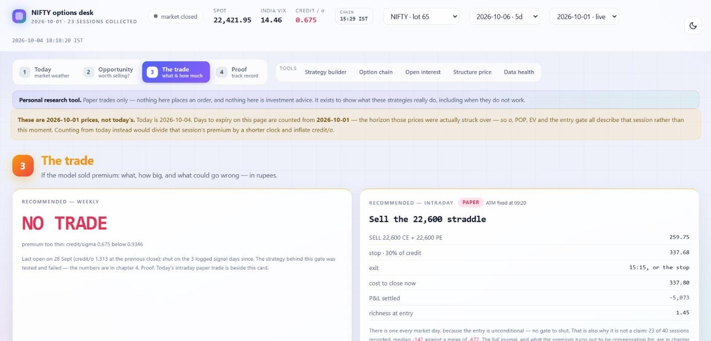
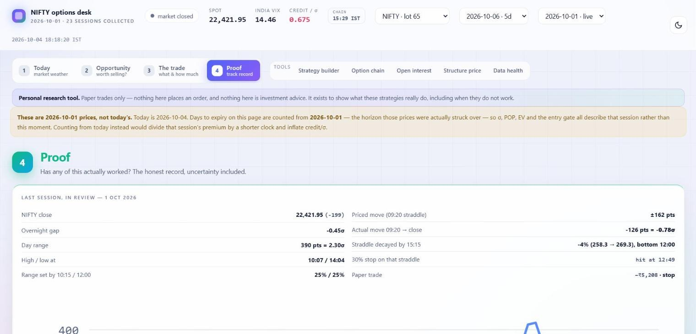
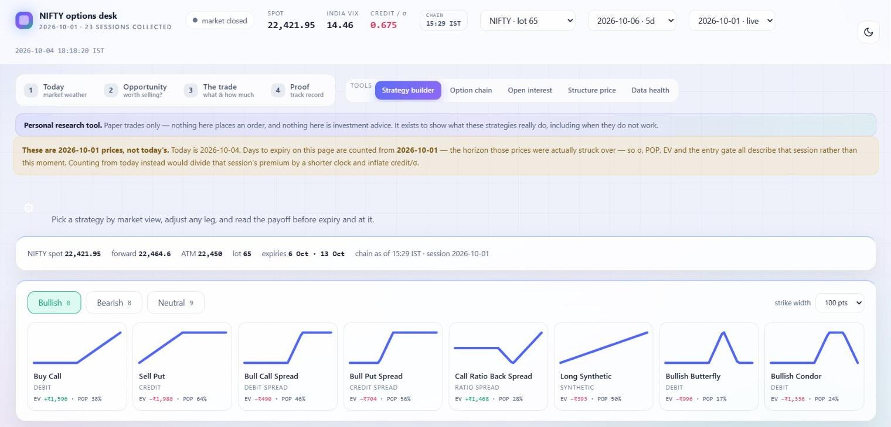
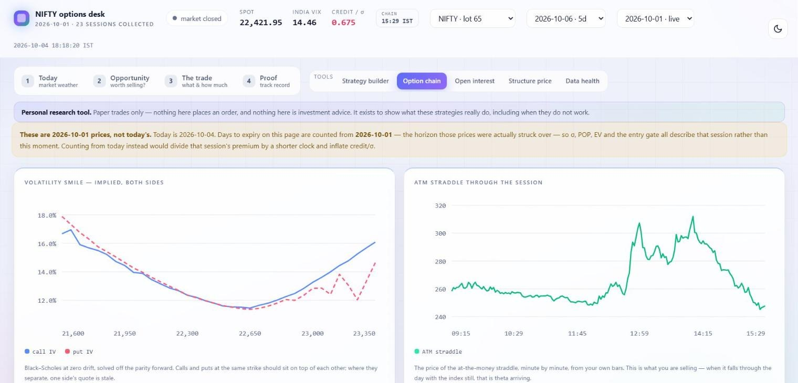
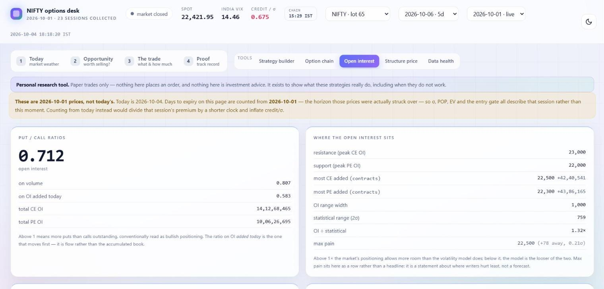
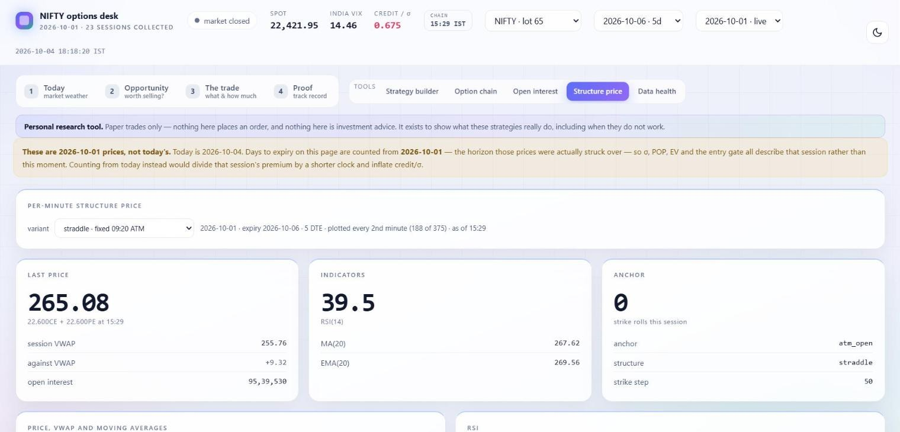
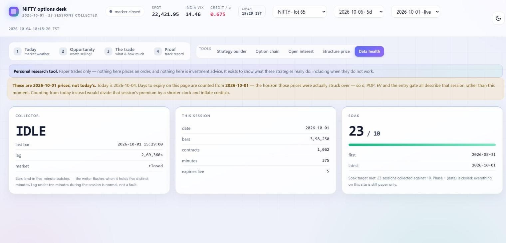

# options-engine


**An end-to-end research system for NSE index options (NIFTY, BANKNIFTY, SENSEX).**
It collects live market data around the clock on AWS, prices and scores option
strategies with probability models, tests those models out of sample, paper-trades
them with real bid/ask fills and charges, and publishes everything to a live dashboard
and a Telegram bot.

Built solo, from an Excel/VBA prototype to a Python service with 540+ automated tests.

> **Research and paper trading only.** Nothing in this repository places a real order,
> and nothing here is investment advice or a recommendation to buy or sell any security.
> The author is not a SEBI-registered Research Analyst or Investment Adviser.

---

## Architecture



Everything runs unattended on one AWS t4g.small (Mumbai) under systemd timers, with a
market-calendar guard, automated TOTP login, end-of-day reconciliation against the
broker's own candles, and a synthetic-tick replay mode for testing offline.

## Screenshots

The live dashboard, light theme, showing the 1 Oct 2026 session (captured on a weekend, so prices are the last close).



| | |
|---|---|
|  |  |
| **Opportunity:** every entry check side by side, not just the loudest one | **The trade:** the weekly entry gate and the daily paper straddle (paper only) |
|  |  |
| **Proof:** the honest track record, starting with the last session in review | **Strategy builder:** 25 strategies grouped by market view, priced on the live chain |
|  |  |
| **Option chain:** implied-volatility smile and the ATM straddle minute by minute | **Open interest:** put/call ratios, OI walls, contracts added and max pain |
|  |  |
| **Structure price:** a fixed-strike straddle with VWAP, MA/EMA and RSI | **Data health:** collector status, bars collected and the soak test |

## What it does

| Area | Highlights | Where |
|---|---|---|
| **Data pipeline** | Live ticks for ~1,700 option contracts across 8 expiries aggregated to 1-minute bars (~190k bars by midday); daily instrument master; Parquet partitions with rollups; EOD reconciliation; morning recovery after outages | [`pipeline/`](pipeline/) |
| **Pricing and volatility** | Bachelier and Black-Scholes pricing off the put-call-parity forward; three sigma sources (India VIX, the expiry's own ATM IV, realised); weekend-aware time decay; implied-vol term structure | [`quant/`](quant/) |
| **Probability and risk** | Probability of profit (normal, lognormal and a historically calibrated version); Monte Carlo probability of a stop being hit, including overnight gaps; expected value after fees and measured slippage; margin, risk-rule and Kelly sizing | [`quant/`](quant/), [`strategy/`](strategy/) |
| **Market microstructure** | Per-strike open-interest buildup (long/short buildup and unwinding), with the forward move removed so price changes are not just the index moving; PCR, max pain, OI walls | [`quant/`](quant/) |
| **Signals and journals** | Daily signal across 7 short-premium structures with an entry gate; intraday paper straddle filled at real bid/ask; an advisory ledger and a separate book ledger; shadow candidate rules tracked forward under a written promotion rule | [`signals/`](signals/), [`tracking/`](tracking/) |
| **Research** | Ten-year replay; walk-forward calibration; P&L attribution into decay, movement, vol, spread and charges | [`research/`](research/), [`tracking/`](tracking/) |
| **Delivery** | FastAPI service; Firebase publisher that only writes changed nodes; single-page dashboard with strategy builder, option chain, OI analytics and a track record; Telegram bot and daily post-mortem | [`service/`](service/), [`firebase/`](firebase/), [`pipeline/`](pipeline/), [`tracking/`](tracking/) |

## What I found

The project is built to test whether an edge is real, not to assume one.

- **The volatility premium exists.** Across ten years of expiries, short-premium zones
  finished inside more often than the model said, by about 6 percentage points. NIFTY
  consistently moved less than India VIX implied, and intraday it moved a median of
  about 0.57x what the 09:20 straddle priced.
- **But it did not survive costs as a weekly strategy.** Measured at the price a seller is
  actually paid, no holding period from 7 to 60 days reached t = 2. An apparent edge at
  0 DTE turned out to be a unit error: a 30-day VIX applied to a one-day horizon.
- **Model probabilities were over-confident live.** Recommended weekly trades predicted
  ~80% POP and realised ~57% (small sample). A historically fitted POP was no better
  than the model's out of sample (Brier 0.21606 vs 0.21608 over 8 years).
- **The daily paper straddle is negative after costs so far,** with fat left tails: many
  days pay a little and a few large days take much more back. With fewer than 40
  sessions recorded, it is too early to call either way.

Negative results are kept on the dashboard on purpose, with confidence intervals and
sample sizes, so nothing is presented as stronger than it is.

## Tech stack

Python (pandas, NumPy, SciPy, PyArrow), FastAPI, Kite Connect API, Parquet, AWS (EC2,
S3, IAM), systemd, Firebase Realtime Database and Hosting, vanilla JavaScript/SVG
charts, Telegram Bot API, pytest, GitHub Actions.

## Project layout

```
pipeline/   live data: broker login, collector, bars, Parquet store, calendar, alerts
quant/      pricing, volatility, probability and option-chain models
strategy/   structures, strategy catalogue, positions, feature store
signals/    daily and live signal generation
tracking/   journals, paper books, shadow candidates, post-mortems
service/    FastAPI endpoints, Firebase publisher, outside-market feed
research/   studies, backtests, calibrations and the ten-year replay
tools/      fixture builder and page render checks
tests/      540+ pytest tests
deploy/     systemd units and install scripts
firebase/   the dashboard (single-page app) and database rules
```

Modules import each other by name (`import pricing`), because the production
server runs everything from one flat folder. `pytest.ini` puts each folder on the
import path for tests and CI; `env.sh` / `env.ps1` do the same for running a script
by hand. `project_paths.py` finds the `data/` folder in either layout.

## Running it

```bash
pip install -r requirements.txt
pytest -q            # 540+ tests, no market data or credentials needed
source env.sh        # (Windows: . .\env.ps1) then e.g. python research/replay.py
```

To run against live data you need a Kite Connect subscription and a `.env` in the
project root (never committed):

```
KITE_API_KEY=
KITE_API_SECRET=
KITE_USER_ID=
KITE_PASSWORD=
KITE_TOTP_SEED=
TELEGRAM_TOKEN=
TELEGRAM_CHAT_ID=
BACKUP_BUCKET=s3://your-bucket
```

Server setup is in [`infra/SETUP.md`](infra/SETUP.md) and the systemd units and install
scripts are in [`deploy/`](deploy/). Market data from Kite Connect and NSE is not included.

## Roadmap

- A daily market-view model: probability of up, down or sideways, plus an IV rich/cheap label
- Strategies grouped by regime (neutral, directional credit and debit, long vol), with custom strategies defined in YAML
- A ₹20 lakh paper book with regime shadow books, daily and per-expiry reports
- Live execution only after a long paper record, under SEBI's retail-algo rules

## Author

**Nisarg** · Computer Science (Data Science) student, Monash University, Melbourne
